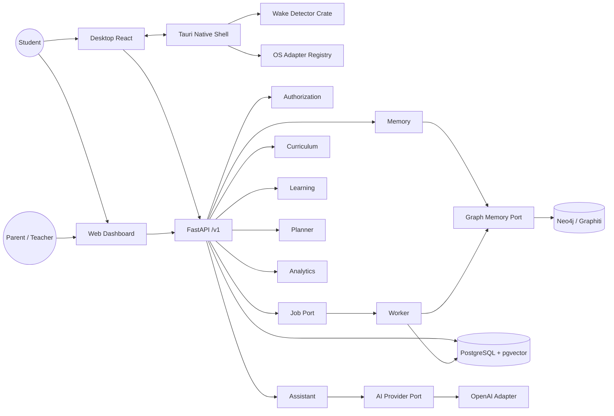
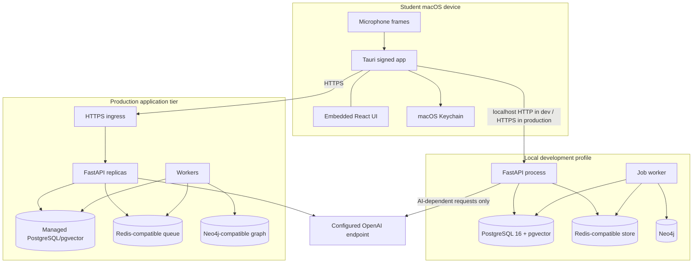

# Design Document: FastLearner Adaptive Learning Application

## Overview

FastLearner extends the implemented Foundation_Baseline into a local-first, internet-connected adaptive study system. The existing npm, Python, and Rust workspaces; React desktop and web shells; Tauri process; FastAPI health endpoint; shared UI/content/contracts packages; conformance suite; and CI remain in place. Product work is added at their existing boundaries rather than replacing the scaffold.

The design separates deterministic learner-state services from AI language capabilities. PostgreSQL with pgvector is canonical; Graphiti/Neo4j augments retrieval; Redis-compatible durable jobs coordinate asynchronous work. The Tauri shell owns operating-system concerns and local wake detection. React clients consume versioned FastAPI contracts, with the separately deployable web dashboard constrained to read-only observer and learner views.

### Design goals

- Preserve local ownership, explicit saving, explicit mutation confirmation, provenance, and age-appropriate defaults.
- Make authorization, planning, mastery, review, pathways, and lifecycle behavior deterministic and testable.
- Keep provider, graph, queue, database, and operating-system integrations behind ports.
- Deliver and sign macOS first while retaining Windows/Linux adapter seams.
- Restore committed state after restart and degrade safely when AI, graph, queue, or network facilities are unavailable.
- Add the missing persistence and local-operation foundation without replanning existing workspace scaffolding.

### Non-goals

The initial release does not implement mobile clients, autonomous browsing/email/submission/calendar mutation, automatic LMS import, unreviewed curriculum publication, diagnostic claims, deterministic career advice, or observer write access.

## Foundation Continuity and Concrete Extension Points

| Existing baseline | Preserve | Product extension |
| --- | --- | --- |
| Root npm workspaces and scripts | Current lint, type, test, build, contract and conformance commands | Add `dev:local`, migration, worker, E2E, accessibility, and release scripts without changing existing meanings |
| `apps/desktop/src/App.tsx` | React/Vite shell | Route composition, dashboard, overlay, API client, local capability bridge |
| `apps/desktop/src-tauri/src/lib.rs` | Tauri v2 entry point | Tray lifecycle, OS adapter registry, permissions, shortcuts, secure storage, notifications, wake controller |
| `crates/wake-detector` | Dedicated Rust crate boundary | Pure detector state machine plus `cpal` capture adapter and fixture benchmarks |
| `apps/web-dashboard` | Independent React/Vite build | Read-only learner/observer dashboard deployment |
| `packages/ui` | Shared component package | Accessible primitives, layouts, evidence/provenance and read-only states |
| `packages/contracts` | OpenAPI-generated TypeScript types | Full `/v1` schema and streaming event discriminated unions |
| `packages/content` | Shared content boundary | Display copy, curriculum manifest/schema helpers, integrity language |
| `services/api/app/main.py` | FastAPI application and health route | Composition root, middleware, routers, lifespan checks |
| `.github/workflows/ci.yml` | Existing cross-language validation | Service-backed integration, migration, accessibility and macOS release jobs |

### Missing foundation gaps to add

1. `infra/docker-compose.yml`: pinned PostgreSQL 16 + pgvector, Neo4j, and Redis-compatible services with health checks, named volumes, localhost-only ports, and development credentials sourced from `.env`.
2. Database stack in `services/api/pyproject.toml`: pinned SQLAlchemy 2 async, psycopg 3, Alembic, pgvector, configuration, Redis/job, Neo4j/Graphiti, AI, auth, and observability dependencies; matching locked resolution.
3. `services/api/alembic/`: migration environment, revision chain, seed strategy, and migration tests.
4. Local auth mode: `AUTH_MODE=local`, loopback-only by default, a stable seeded learner identity, explicit observer personas for tests, and production refusal when local mode is enabled.
5. One-command startup: root `npm run dev:local` invokes a cross-platform Python supervisor that checks configuration, starts/connects Compose dependencies, applies migrations, seeds development data, launches API and worker, then delegates Tauri development startup. It terminates children on exit and prints per-component readiness. A `--services-only` profile supports headless development. Long-running processes are user-invoked, never hidden in tests.

## Architecture

### Component diagram



### Deployment diagram



Production may initially colocate API and worker on one host, but they remain separate processes and deployable units. The web dashboard is static output behind HTTPS and never receives AI credentials. Local product data defaults to local services; cloud sync is a future opt-in adapter.

## Repository and Python Boundaries

The API evolves as a modular monolith so transactions stay simple while ownership remains explicit:

```text
services/api/
  app/
    api/                 # routers, dependencies, request/response mapping, SSE
    auth/                # identity parsing, policy evaluation, local/OIDC adapters
    domain/              # entities, value objects, enums, domain errors, pure rules
    services/            # application use cases and transaction orchestration
      assistant/ memory/ curriculum/ learning/ planner/ analytics/
    repositories/        # Protocol ports and SQLAlchemy implementations
    adapters/            # OpenAI, Graphiti, Neo4j, Redis jobs, files, malware scanner
    workers/             # job handlers and retry/dead-letter policy
    observability/       # structured logging, metrics, redaction
    config.py            # validated runtime settings
    main.py              # composition root only
  alembic/
  tests/{unit,property,integration,contract,e2e}/
```

Dependencies point inward: `api -> services -> domain`; repositories and adapters implement ports declared by the service/domain layer. Domain code imports neither FastAPI, SQLAlchemy, AI SDKs, Graphiti, nor Redis. Analytics is query-only. Assistant orchestration can call read ports and create proposals, but only the owning application service can perform a confirmed mutation.

```python
from dataclasses import dataclass
from typing import AsyncIterator, Protocol
from uuid import UUID

@dataclass(frozen=True)
class ActorContext:
    actor_id: UUID
    owner_id: UUID
    role: str
    scopes: frozenset[str]

class UnitOfWork(Protocol):
    assignments: "AssignmentRepository"
    learning: "LearningRepository"
    outbox: "OutboxRepository"
    async def __aenter__(self) -> "UnitOfWork": ...
    async def __aexit__(self, exc_type, exc, tb) -> None: ...
    async def commit(self) -> None: ...

class AIProvider(Protocol):
    async def generate(self, request: "GenerationRequest") -> "GenerationResult": ...
    def stream(self, request: "GenerationRequest") -> AsyncIterator["ProviderEvent"]: ...
    async def structured(self, request: "StructuredRequest[T]") -> "T": ...
    async def embed(self, texts: list[str]) -> list[list[float]]: ...
```

`ActorContext.owner_id` is resolved server-side. Repository methods require it as a positional scope and never accept an unverified request-body owner. Transactions use `READ COMMITTED` plus row locks/version columns for contended mastery and idempotency records; retryable serialization/conflict errors map to typed API errors.

## Identity, Authentication, and Authorization

`IdentityProvider` has `LocalIdentityProvider` and future OIDC/session implementations. Local mode seeds a fixed learner and optional parent/teacher identities, issues short-lived signed development sessions, binds only to loopback unless explicitly overridden, and is forbidden when `ENVIRONMENT=production`. Secrets are loaded server-side; desktop session material is stored through the OS secure-store adapter.

Authorization is relationship- and resource-based:

1. Authenticate actor and session.
2. Resolve the learner owner from actor identity or an active `user_relationships` row; ignore client owner IDs.
3. Intersect endpoint-required scopes with relationship `permission_scope`.
4. Enforce observer read-only policy before service invocation.
5. Add owner predicate to every repository query; scope-safe absence returns the same not-found shape whether a foreign record exists or not.
6. Audit confirmed mutations and pseudonymous denials.

Policies are centralized as `PolicyEngine.authorize(actor, action, resource_kind, subject_id?)`. Representative scopes are `dashboard:read`, `assignments:read`, `learning:read`, `memory:read`, and `pathways:read`; learner ownership grants enabled learner actions, while observer relationships only grant listed `*:read` scopes. Revocation is checked against the database/session version on each request, so subsequent access ends immediately.

## Desktop Native Design

### Tauri shell and OS adapter registry

`apps/desktop/src-tauri` composes platform-neutral commands and these Rust traits:

```rust
pub trait TrayAdapter { fn install(&self, actions: &[TrayAction]) -> Result<(), OsError>; }
pub trait ShortcutAdapter { fn register_wake(&self, chord: &str) -> Result<(), OsError>; }
pub trait PermissionAdapter { fn microphone_state(&self) -> PermissionState; fn request_microphone(&self) -> Result<PermissionState, OsError>; }
pub trait SecureStore { fn put(&self, key: &str, secret: &[u8]) -> Result<(), OsError>; fn get(&self, key: &str) -> Result<Option<Vec<u8>>, OsError>; }
pub trait NotificationAdapter { fn notify(&self, message: Notification) -> Result<(), OsError>; }
pub trait LoginItemAdapter { fn set_enabled(&self, enabled: bool) -> Result<(), OsError>; }
pub trait DisplayAdapter { fn active_display_bounds(&self) -> Result<Rect, OsError>; }
```

`MacOsAdapters` ship first; `WindowsAdapters` and `LinuxAdapters` implement the same registry without changing Tauri commands or Python contracts. Commands include `get_capabilities`, `set_wake_config`, `pause_wake`, `open_overlay`, `secure_session_set`, `secure_session_clear`, and `quit`. Events include `wake://detected`, `wake://state`, `permission://changed`, and `sync://state`. Main-window close hides rather than exits; explicit Quit stops capture, unregisters shortcuts, flushes diagnostics, and terminates.

Tray failure is nonfatal and leaves the main window and shortcut/text paths available. Permission denial, device loss, and pause all synchronously stop and drop the audio stream before reporting the state. Start-at-login is opt-in. Production CSP restricts connections to the configured API origin and removes the baseline `null` CSP.

### Wake detector interface and algorithm

The `wake-detector` crate separates pure analysis from audio I/O:

```rust
pub trait FrameSource { fn next_mono_frame(&mut self) -> Result<Option<AudioFrame>, AudioError>; }
pub trait WakeSink { fn emit(&mut self, event: WakeEvent); }
pub struct DetectorConfig { pub frame_ms: u16, pub sensitivity: f32, pub min_gap_ms: u16, pub max_gap_ms: u16, pub cooldown_ms: u16 }
pub enum DetectorState { Listening, OneTransient { at_ms: u64 }, Cooldown { until_ms: u64 }, Paused, Unavailable }
pub struct WakeDetector<F: FrameSource, S: WakeSink> { /* bounded rolling energy only */ }
```

The capture adapter uses `cpal`, selects mono or downmixes in memory, applies a high-pass/band-pass transient filter, and computes RMS/peak over configurable 10–30 ms frames. An exponentially weighted noise floor defines the sensitivity-adjusted threshold. A candidate must satisfy peak, rise/fall, and maximum-duration constraints. Two candidates 120–900 ms apart emit exactly one event and enter a 1.5–3 second cooldown. Time is monotonic; stale first transients expire. Buffers are fixed-size, zeroed/dropped, never serialized, and inaccessible to network code. Only opted-in aggregate diagnostic events (configuration bucket, expected/detected label, timestamp, false-positive/negative marker) persist.

Visible overlay confirmation precedes a separate speech-capture command. Wake events never start STT or invoke the API. Fixture tests feed synthetic/noisy envelopes through the pure state machine; a documented quiet-room corpus measures the 90% benchmark and reports hardware/configuration, not a field guarantee.

## React Client Architecture

`packages/ui` contains accessible presentation only: design tokens, `AppFrame`, navigation, data tables, calendar/heatmap alternatives, `Overlay`, `EvidenceDrawer`, `ProvenanceList`, `EmptyState`, `UnavailableState`, `ReadOnlyBanner`, confirmation panels, and form controls. Components accept data and callbacks and do not call Tauri or the API.

`apps/desktop/src` adds:

- `app/`: router, providers, query/cache client, typed API client, error boundary.
- `features/dashboard|subjects|assignments|memory|schedule|insights|practice`: desktop learner routes.
- `features/companion`: overlay state machine (`idle`, `listening`, `thinking`, `answer`, `confirmation`, `offline`, `error`) and native event bridge.
- `platform/tauri.ts`: the only React module importing Tauri APIs.
- `auth/`: secure-session bootstrap and application lock.

`apps/web-dashboard/src` has an independent entry, deployment configuration, session bootstrap, learner/observer read-only routes, and no Tauri imports. It reuses `packages/ui`, `packages/contracts`, and shared view-model mappers, but omits mutation clients and controls for observer sessions. Cache entries carry `fetchedAt`; API outage renders unavailable/stale labeling and never implies stale data is current.

Server state is authoritative and invalidated after confirmed writes. Draft forms and proposed actions stay in client state until confirmation. Voice transcription and typed text enter the same `AssistantMessageRequest`, ensuring intent parity. All workflows are keyboard operable, restore focus intentionally, expose semantic headings/live regions, provide non-color status cues, and offer table/list alternatives to visual graphs and calendars.

## Canonical Data Model

All learner-owned tables use UUID primary keys, `owner_user_id`, `created_at`, `updated_at`, UTC `timestamptz`, and indexes beginning with owner scope. Subject-specific rows additionally carry `subject_id`. Soft lifecycle markers are used where audit/retraction is required; hard cleanup follows policy. Enum values are database constraints mirrored by Python enums and OpenAPI schemas.

### PostgreSQL and pgvector schema

| Area | Tables and key constraints |
| --- | --- |
| Identity | `users`; `profiles(user_id PK/FK)`; `user_relationships(owner_user_id, learner_user_id, role, permission_scope jsonb, status, expires_at)`; `devices`; `sessions`; unique active relationship policy |
| Curriculum | `subjects(slug, owner_user_id nullable, archived_at)`; `concepts(subject_id,key)`; `concept_edges(concept_id,prerequisite_concept_id)` unique and no self-edge; `content_items`; `question_versions`; `content_reviews`; immutable content/question versions referenced by attempts |
| Learning | `learning_events(owner_user_id,idempotency_key,operation_scope)` unique; `mastery_state(owner_user_id,concept_id)` PK with version; `bkt_parameter_sets`; `review_state(owner_user_id,concept_id)` PK; `mastery_snapshots`; `recommendations` |
| Work | `assignments`; `assignment_tasks(assignment_id,position)`; `availability_windows`; `study_blocks` with range/conflict indexes; `study_block_reason_history`; `effort_entries`; `goals` |
| Memory | `sources`; `memory_episodes`; `source_chunks(content, embedding vector(N), metadata jsonb)` with owner/subject/lifecycle filters; `memory_retrieval_log` containing hashes and IDs only; `consents`; `auto_save_rules` |
| Actions/API | `action_proposals` with expiry/status/payload hash; `idempotency_records(owner_user_id,operation,key,response_status,response_body_hash/result_ref)` unique; `audit_records`; `outbox_jobs` |
| Operations | `job_runs`, `graph_sync_state`, `deletion_requests`, `export_requests`, `rule_versions`, `diagnostic_records` |

PostgreSQL row-level security is defense in depth for hosted deployments, using transaction-local owner/actor settings; repository predicates remain mandatory and are tested independently. Vector indexes are created only after representative dimension/configuration is known. Search always applies owner, subject, and `deleted_at IS NULL` predicates before distance ordering. Content text may be separated from metadata into encrypted/local file storage later without changing repository contracts.

### Alembic strategy

- A single linear revision chain is the default; merge revisions are prohibited on release branches.
- Revision 1 enables `vector` and creates identity/authorization and migration metadata; subsequent bounded revisions add curriculum, work, learning, memory/vector, actions/outbox, and indexes.
- Data seeds are versioned application commands, not irreversible migration side effects. A curriculum manifest with a stable pack/version checksum upserts the initial 15-node math DAG and reviewed seed content.
- Expand/contract is used for production changes: add nullable/new structures, backfill in resumable batches, switch application reads/writes, then enforce/drop in a later release.
- Every revision defines downgrade where data-safe; destructive revisions require backup, explicit release note, and forward-recovery procedure.
- CI migrates an empty database to head, validates schema/model consistency, runs seed twice for idempotence, and tests upgrade from the previous release snapshot.
- API startup checks revision compatibility and reports `database_migration_required`; production never auto-migrates, while `dev:local` applies migrations explicitly before startup.

## Graph Memory and Background Jobs

### Graphiti/Neo4j adapter

```python
class GraphMemoryPort(Protocol):
    async def ingest_episode(self, episode: GraphEpisode) -> GraphReceipt: ...
    async def search(self, scope: GraphScope, query: str, limit: int) -> list[GraphFact]: ...
    async def retract_episode(self, scope: GraphScope, episode_id: UUID) -> GraphReceipt: ...
    async def health(self) -> DependencyHealth: ...
```

`GraphitiGraphMemory` maps authenticated scopes to exactly `user:{owner_id}` or `user:{owner_id}:subject:{subject_id}`. Metadata carries source/episode IDs, visibility, timestamps, confidence, and schema version. Returned facts are rejected unless their provenance maps to a live, permitted canonical episode. Graph results never override canonical assignments, permissions, curriculum, mastery, review, or schedules. A `Noop/UnavailableGraphMemory` supports local degraded operation and typed supplementary-context warnings.

### Redis-compatible jobs and transactional outbox

Domain transactions insert an `outbox_jobs` row with a deterministic deduplication key. A relay publishes to the Redis-compatible queue; workers claim jobs and persist `job_runs`. Jobs include source chunking, embeddings, graph ingestion, graph retraction, physical cleanup, export assembly, malware scanning, reminders, and aggregate refresh.

Delivery is at least once; handlers are idempotent. States are `pending`, `leased`, `retry_wait`, `succeeded`, `dead_letter`, or `cancelled`. Exponential backoff with jitter has per-kind limits; deletion jobs never restore retrieval eligibility and remain visibly failed/retryable after exhaustion. Lease expiry makes work eligible after worker death. Payloads contain IDs, not full student content where avoidable. Queue loss cannot erase committed intent because the outbox remains canonical.

## AI Provider and Assistant Design

The vendor-neutral adapter exposes generation, token streaming, structured output validated against Pydantic/JSON Schema, embeddings, and optional STT/TTS. `OpenAIProvider` is selected first by server-side `AI_PROVIDER=openai`, model and embedding settings. Provider-specific requests/responses are translated to `GenerationRequest`, `GenerationResult`, `ProviderEvent`, `Usage`, and typed `ProviderError`; no OpenAI types cross the adapter.

Provider errors (`unavailable`, `timeout`, `rate_limited`, `invalid_output`, `safety_rejected`) cannot mutate canonical state. Structured output is validated before becoming a draft. Alternate providers implement the same contract; deterministic domain services are injected independently and remain unchanged.

Assistant flow:

1. Validate non-empty text/transcript and authenticate scope.
2. Classify to one of nine intents with structured output and validate it.
3. Read canonical assignments, schedule, mastery, and approved curriculum first.
4. Retrieve owner-filtered pgvector chunks, then permitted Graphiti facts; tolerate supplementary failure with explicit degraded status.
5. Deduplicate by canonical source/fact identity and deterministically rank using normalized relevance, recency, graph relation, subject match, and user confidence.
6. Enforce record and token budgets before provider invocation.
7. Treat imported instructions as quoted evidence, never system/tool authority.
8. Stream a response with citations or an explicit uncertainty/no-record statement.
9. Store only retrieval IDs/hashes and operational metadata by default.
10. Represent any mutation as an expiring `action_proposal`; confirmation calls the owning service once through idempotency, rejection changes proposal state only.

Allowed assistant tools are bounded reads/searches, approved-content retrieval, and draft creation. Unsupported LMS/calendar import, browsing, email, submission, external calendar mutation, diagnosis, and career-verdict requests produce limitations and safe alternatives. Academic-integrity policy shifts assessed-work requests toward hints, explanations, analogous examples, and review.

## Deterministic Learning, Review, Planning, and Pathways

### Curriculum DAG and practice

A pure topological-sort validator returns either an ordering or the exact cycle edges. Publication runs validation in the same transaction as status changes. The initial curriculum manifest contains the required 15 concepts and edges, including decimal place value before fractions-as-decimals, and at least one lesson plus three versioned questions/answers/explanations per concept. Generated content remains draft until review; serving selects published curated content first, excludes retired versions, and retains historical question-version references.

Objective generated questions require concept IDs, grade, difficulty, answer specification, solution and distractor rationales, and source/model provenance. A deterministic validation pipeline checks answer evaluation, near-duplicate similarity threshold, grade vocabulary/range, safety, and subject/concept relevance. Failed checks withhold the item. No served question means no attempt record.

### BKT

`bkt_update(prior, correct, params) -> next_probability` is a total pure function for valid parameters. For correct and incorrect observations it uses the specified posterior equations, followed by `next = posterior + (1 - posterior) * p_transition`. Parameters satisfy `0 <= p_* <= 1`, with denominators validated nonzero. Decimal/numeric precision and a final defensive clamp keep persisted values in `[0,1]`; invalid parameter sets produce configuration errors rather than updates.

Learning-event handling uses one transaction: claim operation idempotency; validate served question/concept/owner context; insert event; `SELECT ... FOR UPDATE` the mastery row; apply the effective parameter set; update mastery/version; insert snapshot; update review state if relevant; create recommendation; insert outbox/aggregate work; commit. Any failure rolls back all. Correctness alone is the BKT observation. Duration, hints, and retries only produce versioned pacing flags included in reasons.

Recommendation bands are deterministic: below `.60`, same-concept alternate explanation/question; `[.60,.85)`, continue with rule-versioned prerequisite/due-review insertion; at least `.85`, temporarily master, unlock successors whose prerequisites are mastered, and schedule first review. Every result includes rule version, evidence IDs, confidence rationale, and learner-readable next action.

### Spaced review

A versioned SM-2-style pure function maps `(previous_state, correctness, duration_band, hint_used, retries)` to `(quality 0..5, next_state)`. Low quality resets/shortens interval; a slow or hint-heavy correct answer receives lower quality than independent success. Due dates use the learner timezone for display but are stored as UTC instants. Missing rule versions fail without mutation. Querying when none are due returns `[]` and never touches state.

### Planner

The planner creates immutable `CandidateWork` values from overdue/near-due tasks, due reviews, blocking concepts, goals, availability, workload limits, and subject history. A versioned integer/fixed-point score avoids floating nondeterminism:

```text
score = deadline_urgency + review_urgency + mastery_gap + goal_value
        - fatigue_penalty - repetition_penalty
sort key = (-score, due_at_or_max, kind_priority, stable_resource_uuid)
```

The allocator clips availability against existing blocks, sorts windows chronologically, and greedily places 15–45 minute chunks without overlap up to requested and daily limits. Work below 15 remaining minutes may be merged into a related block only if the result remains at most 45; otherwise it is reported unscheduled. `reason_json` persists rule version, all score inputs, selected score, constraint effects, source IDs, and human text. Equal inputs always yield equal output. Conflicts and AI-drafted changes remain previews until explicit confirmation. Persistence replaces no schedule until the complete plan transaction succeeds.

### Pathway signals

Analytics groups eligible, nondeleted evidence by subject/session. Fewer than 20 attempts or 3 sessions yields insufficient evidence. Otherwise versioned rules compute bounded measures for accuracy, persistence, response-time trend, chosen activity, completed work, and volume, then classify confidence `low|medium|high`. Output always contains counts, measured trend, uncertainty, rule version, and exploration action; prohibited labels/diagnoses/rank/career verdicts are not representable in the response enum. Deletion invalidates aggregates and recalculates from remaining evidence.

## API and Streaming Contracts

All product routes use `/v1`; `/health` and `/v1/health` may coexist for deployment compatibility. JSON uses UTC RFC 3339 timestamps, UUID strings, discriminated unions, cursor pagination, and typed errors. Every write requires `Idempotency-Key`; the effective key is `(owner_id, operation_id, key)`.

Core resources:

- Identity/read models: `GET /v1/me`, `/dashboard`, `/subjects`, `/subjects/{id}`, `/subjects/{id}/concepts`.
- Assistant: `POST /v1/assistant/messages`, `POST /v1/assistant/actions/{id}/confirm|reject`.
- Memory: `POST /v1/memory/episodes`, filtered search/detail, `DELETE /v1/memory/episodes/{id}`, `POST|GET /v1/memory/exports`.
- Assignments/planning: assignment CRUD, `extract-tasks`, plan generation, study-block list/patch/complete.
- Learning: events, next, mastery, due reviews, practice generation and answer.
- Analytics: subjects, time-on-task, streaks, pathway signals.
- Lifecycle: account deletion status, job/synchronization status, consent management.

Observer sessions can call only read endpoints allowed by scope. Mutation route authorization occurs before body-driven resource lookup. Not-found responses are scope-safe.

### Server-sent event contract

`POST /assistant/messages` returns `text/event-stream`; clients reconnect by starting a new request rather than replaying unsafe generation. Each event has `request_id`, monotonically increasing `sequence`, and a discriminated payload:

```text
event: response.started     {intent, retrieval_status}
event: response.delta       {text}
event: citation.added       {citation_id, source_kind, source_id, label, captured_at}
event: action.proposed      {action_id, action_type, preview, expires_at}
event: response.warning     {code, safe_message}
event: response.completed   {usage_bucket, citations, finish_reason}
event: response.failed      {error: ApiError}
```

Deltas are display-only and never treated as canonical state. A proposal is usable only after its durable `action.proposed` event/reference exists. Heartbeats contain no learner data. Disconnect cancels provider work when possible but does not mutate state. Backpressure uses a bounded per-request queue; overflow cancels with a typed retryable error.

Errors use `{code, message, request_id, fields?, retryable, dependency?}`. Stable codes cover validation, authentication, authorization, scope-safe not found, conflict, idempotency mismatch, rate limit, provider unavailable, dependency unavailable, migration required, action state, and configuration. Safe messages never include secrets, prompts, foreign IDs, or graph internals.

## Provenance, Deletion, and Export Flows

### Provenance model

`ProvenanceRef` is embedded or linked from answers, memories, schedule blocks, recommendations, generated content, and pathway signals. It identifies source/evidence IDs, capture/decision time, rule/model/content version, confidence, owner visibility, and explanatory reason. UI resolves refs through authorized endpoints and shows unavailable/deleted labels rather than leaking inaccessible content.

### Deliberate capture and retrieval

Explicit save or a named consented auto-save rule creates source and episode records in one transaction, sets graph state pending, and writes an outbox job. Ordinary chat is never converted to an episode. File intake is quarantined, size/type checked, malware scanned, parsed as untrusted data, then accepted or rejected. Graph failure leaves the canonical episode searchable with failed sync status.

Retrieval composes canonical results first, live source chunks second, and verified graph facts third. Deleted/restricted records are filtered before ranking and again when materializing context. No-result behavior preserves filters. Retrieval logs retain query hashes, selected IDs, purpose, and counts—not raw speech, prompt, or full note content.

### Forget/delete

Within one transaction, `forget` validates owner scope, marks episode/source deleted, invalidates chunks and graph eligibility, records audit/idempotency, and enqueues one graph-retraction/physical-cleanup outbox job. From commit onward all retrieval paths exclude the data, even if Neo4j is unavailable. The worker retracts graph facts, deletes derived vectors/files under retention policy, removes graph links, and marks completion. Retry/dead-letter remains visible but never reverses canonical deletion. Account deletion first confirms identity, revokes sessions/consents, marks owned data, and fans out idempotent cleanup jobs.

### Structured export

An export request snapshots an owner-scoped consistency boundary and produces a documented versioned archive: `manifest.json`, profile, subjects, assignments/tasks/goals, learning/mastery/reviews, schedules, memory episodes/sources, consents, and provenance. Every category appears even when empty. Raw secrets, raw audio, internal prompts, and inaccessible observer data are excluded. Checksums and schema version are recorded; download uses short-lived authorization and local files use owner-only permissions. Export generation is retryable and auditable.

## Observability, Security, and Privacy

A request-ID middleware creates structured events and propagates IDs through provider calls and jobs. Logs contain pseudonymous actor, endpoint, latency, provider/model, usage/cost bucket, retrieval count, worker state, recommendation/rule version, and safe outcome. A deny-by-default redactor excludes full notes, voice, prompts/responses, tokens, credentials, encryption keys, and session secrets. Logging failures go to a safe fallback channel and never roll back or change domain transactions.

Security controls include:

- TLS for non-loopback traffic, strict CORS/origin policy, secure cookies/session rotation, CSRF protection where cookie auth is used, and CSP in both clients.
- OS keychain/credential vault for desktop secrets; no AI key in Vite variables, browser storage, Postgres, or committed files.
- Repository owner scoping plus policy checks and optional PostgreSQL RLS defense in depth.
- Account/window rate limits for AI and writes, with no mutation after denial.
- Upload quarantine, allowlisted parsers, size/type limits, malware scanner port, no execution/macros, and prompt-injection boundary labels.
- Confirmed-action audit with actor, owner, target, action, request ID, and UTC time.
- Minimal PII, no behavioral trackers by default, separately consented pseudonymous telemetry, diagnostic deletion controls, and no raw wake/speech persistence.
- Optional desktop app lock gating rendering and clearing sensitive UI/cache on lock.

Threat-model review covers cross-owner enumeration, observer escalation, compromised imported content, action-proposal substitution, idempotency replay across operations, SSE citation spoofing, queue payload leakage, graph stale facts, local-mode exposure, and key extraction.

## Availability, Performance, Accessibility, and Resilience

Dashboard reads use SQL aggregates/materialized read tables incrementally refreshed by committed events; correctness never depends on cache freshness. The normal-state benchmark records dataset size, hardware, warm/cold status, and requires service-boundary p95 under one second. Owner-prefixed indexes, bounded pagination, eager query review, and explain-plan snapshots prevent N+1/regressions.

Retrieval limits cap source count, graph facts, per-source characters, and estimated model tokens before provider invocation. Worker concurrency and provider calls have deadlines/circuit breakers. The wake detector uses fixed buffers and benchmarked CPU/RSS in tray mode.

WCAG 2.2 AA is the target: complete keyboard flows, visible focus, logical order, semantic controls/headings, names/descriptions, live status announcements, reduced-motion support, contrast, scalable text, non-color evidence, and accessible alternatives for heatmaps/graphs/calendars. Desktop Student, web Student, and observer modes receive automated axe checks plus keyboard and screen-reader manual scripts.

Committed state survives restart in PostgreSQL; client caches are disposable. Outbox and leases recover workers. Dependency health distinguishes required (Postgres) and degradable (AI, graph, queue for read-only operations) capabilities. Failed writes retain the last commit and return retry-safe errors. Backup procedures cover PostgreSQL/pgvector together, Neo4j graph snapshots, encryption/config metadata, restore ordering, and reconciliation from canonical episodes if graph recovery lags.

## macOS-First Release and Portability

The first production pipeline builds universal/supported macOS artifacts, applies Developer ID signing, hardened runtime and least-privilege entitlements, submits notarization, staples results, and verifies signatures/update manifests. Microphone usage descriptions and permission behavior are release-tested. Updates use signed manifests and verified transport; rollback retains database compatibility.

Portable interfaces isolate tray, shortcut, permission, secure storage, notification, login-item, display, and audio-device behavior. Platform capability responses let React disable unsupported options gracefully. Windows uses its credential manager/startup/notification conventions; Linux uses Secret Service/desktop/autostart conventions and documents compositor/global-shortcut limitations. Domain API, contracts, planner, learning logic, and memory lifecycle do not vary by OS.

## Configuration and Local Development

`Settings` validates `.env` at startup and reports only missing key names. `.env.example` already contains the required core placeholders and is extended only for nonsecret mode/port settings such as `AUTH_MODE=local` and `ENVIRONMENT=development`. Production rejects default passwords, empty signing/encryption settings where required, local auth, wildcard CORS, and insecure non-loopback API URLs.

`infra/docker-compose.yml` pins images by version/digest, declares Postgres/pgvector, Neo4j, and Redis-compatible health checks, named volumes, and a private network. `npm run dev:local` uses a checked-in cross-platform supervisor rather than shell-specific chaining. Readiness order is dependencies → migration → seed → API/worker → Tauri. It prints URLs, local personas, degraded optional features, and exact remediation. Shutdown is coordinated; data remains in volumes. `npm run dev:reset` is explicitly destructive and separate.

## Migration and Delivery Sequence

1. Preserve baseline checks; add dependencies, Compose, settings, local auth, Alembic, transaction/outbox primitives, and one-command supervisor.
2. Add identity/authorization and canonical subject/assignment/dashboard state through generated contracts and shared UI.
3. Add planner/reasons, then native shell/wake interfaces, then deliberate memory/vector/graph jobs.
4. Add curriculum seed, BKT/review/recommendations, practice, and pathways.
5. Add OpenAI adapter, bounded retrieval, streaming assistant, proposals/confirmation, and generated-content validation.
6. Harden observer deployment, lifecycle/export, accessibility, performance, backups, signing, and portability adapters.

Each increment is forward-compatible, contract-generated, migration-tested, and feature-gated when an optional dependency is absent. Existing baseline checks remain mandatory throughout.

## Testing Strategy

Testing is layered and complementary:

- **Unit/example tests:** lifecycle transitions, threshold boundaries, permission denials, empty states, typed errors, local-auth startup guards, content policies, UI state/focus, and OS-adapter error recovery.
- **Property-based tests:** pure BKT/review/planner/ranking/DAG/wake state logic, authorization scope filtering, idempotency state machines, provenance-preserving transformations, export shape, and lifecycle invariants. Python uses Hypothesis and Rust uses proptest; TypeScript uses fast-check where view-model transformations warrant it. Each property runs at least 100 generated cases and carries `Feature: adaptive-learning-app, Property N: <title>`.
- **Integration tests:** ephemeral PostgreSQL/pgvector, Neo4j/Graphiti, and Redis-compatible services validate migrations, repositories, outbox recovery, ingestion/retrieval/retraction, vector filters, RLS, worker retries, and OpenAPI generation. Provider and malware ports use deterministic fakes except a separately gated provider smoke test.
- **Contract tests:** FastAPI OpenAPI is regenerated; desktop/web clients compile against it; SSE event fixtures and errors are tested for backward compatibility; generated drift fails CI.
- **End-to-end tests:** assignment → confirmed plan → focus completion; keyboard/wake fixture → overlay → cited answer; deliberate save → retrieval → forget → exclusion; practice → one mastery update → recommendation; observer deployment → scoped reads and denied writes; export and restart persistence.
- **Security tests:** tenant/observer isolation, foreign-ID indistinguishability, proposal substitution, prompt injection in imports, upload limits/malware rejection, rate limits, secret/log scanning, local-auth production refusal, and zero wake-network/audio persistence.
- **Accessibility tests:** axe checks, keyboard scripts, focus restoration, screen-reader labels/live regions, and visual-state alternatives across desktop, web learner, and observer experiences.
- **Performance/release tests:** one-second dashboard benchmark, bounded retrieval, worker recovery, wake CPU/RSS and quiet-room detection corpus, backup restore drill, migration from prior release, macOS signing/notarization/update verification.

Properties exercise pure logic or in-memory models; external services and infrastructure are covered with a small number of integration/smoke scenarios rather than repeated property runs. Database concurrency tests supplement pure idempotency/transaction models. Failures print minimized generated counterexamples, rule/parameter versions, and seeds without learner content.